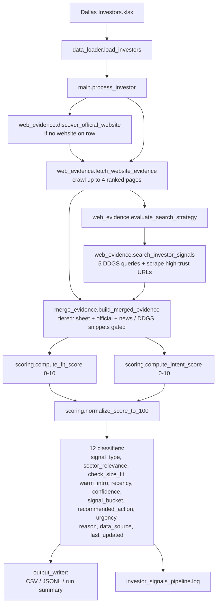

# Investor Signal Detection Tool

## What it does

This is a local Python pipeline that turns a spreadsheet of investors into a
ranked, business-facing signal report. For every investor it answers a single
question:

> Given our deal thesis (sector / stage / check size / geography), how
> strong is the signal that **this investor is likely to invest right now**,
> and how confident are we in that conclusion?

For each investor the tool:

1. Reads the structured row from `Dallas Investors.xlsx` (the **investor
   database**).
2. Finds and crawls the investor's **official website** (4 pages max,
   ranked: portfolio, team, contact, careers, news, homepage).
3. Searches **news/press** via DuckDuckGo with 5 targeted queries,
   ranks the results by a trust-tier model, then scrapes only the
   high-trust URLs (official domain + reputable news outlets).
4. **Merges** spreadsheet + official-site + news/press evidence into
   four target-aligned text dimensions (sector, stage, geography,
   strategic).
5. **Scores** the merged evidence on a deterministic 0–20 rubric:
   Fit (0–10) + Intent (0–10).
6. Normalizes to a 0–100 **Signal Score** and runs ~12 classifiers to
   produce the business-facing CSV columns (`Signal Bucket`,
   `Recommended Action`, `Urgency`, `Confidence`, `Warm Intro`, etc.).
7. Writes the 15-column CSV deliverable plus a per-investor JSONL trace
   so every score is auditable back to its source URLs.

The CSV is what the business sees. The debug JSONL, run summary, and log
exist so any score can be traced back to the exact text and URLs that
produced it.

---

## Quick start

```bash
pip install -r requirements.txt
python main.py
```

The default 15-investor run takes ~6–10 minutes end-to-end because the
HTTP and DDGS layers politely rate-limit themselves. Tail
`investor_signals_pipeline.log` while it runs.

All tunable knobs (deal thesis, network limits, trusted news domains,
crawl depth, output paths) live in `config.py`.

---

## Outputs

| File | Purpose |
|------|---------|
| `investor_signals_report.csv` | The 15-column business deliverable, sorted by `Signal Score` descending. |
| `investor_signals_debug.jsonl` | One JSON record per investor: input, evidence summaries, source URLs, merge debug, fit/intent breakdowns, classifier outputs. |
| `investor_signals_run_summary.json` | Run-level counts (succeeded / partially failed / no website evidence) and output paths. |
| `investor_signals_pipeline.log` | Timestamped pipeline log. |

### The 15 CSV columns

| # | Column | Range / type |
|---|--------|--------------|
| 1 | `Investor` | Name from the spreadsheet. |
| 2 | `Signal Score` | Integer 0–100. |
| 3 | `Investment Probability (%)` | Integer 0–85. Heuristic, explainable mapping — not a calibrated statistical model. |
| 4 | `Signal Type` | `Active Investing` / `Fundraising` / `New Fund` / `Public Activity` / `Similar Portfolio Activity` / `Sector Match Only` / `Weak / No Recent Signal`. |
| 5 | `Sector Relevance` | `High` / `Medium` / `Low`. |
| 6 | `Check Size Fit` | `Perfect fit` / `Slight mismatch` / `Poor fit`. |
| 7 | `Warm Intro Signal` | `Direct connection` / `1st degree mutual` / `2nd degree` / `None`. **No LinkedIn scraping.** |
| 8 | `Recency` | `Last 30 days` / `Last 30-60 days` / `Last 60-90 days` / `Older / unclear`. |
| 9 | `Confidence` | `High` / `Medium` / `Low`. |
| 10 | `Reason` | Concrete 1–2 line summary grounded in actual data points (counts, last portfolio company, named fund, fund close date). |
| 11 | `Recommended Action` | `Reach out immediately` / `Prioritize with warm intro` / `Monitor for now` / `Low priority`. |
| 12 | `Signal Bucket` | `Immediate Target` / `High Priority` / `Secondary` / `Ignore`. |
| 13 | `Urgency / Timing` | `Act within 14 days` / `Act within 30 days` / `No urgency`. |
| 14 | `Data Source` | e.g. `Investor database, Official site, News/press`. |
| 15 | `Last Updated` | Most recent dated evidence (`YYYY-MM-DD`), empty when none. |

Column order is the contract — defined in `output_writer.CSV_COLUMNS`
and mirrored by `validation.validate_result_row`.

---

## Pipeline architecture



Each stage in `main.process_investor` is wrapped in its own `try/except`.
A failure in one stage records itself into `processing_notes` but does
not abort the run. Per-investor reliability is then classified
(`status`, `failure_reasons`, `warning_reasons`) and surfaced in the
JSONL.

---

## Stage 1 — Loading the investor database

`data_loader.load_investors(path, max_n)`:

1. `pd.read_excel(path, header=6)` — the Dallas workbook has 6 header rows
   above the actual table.
2. For each row, every column in `config.FIELD_MAP` is normalized via
   `utils.to_clean_text` (strips whitespace, collapses
   `NaN/None/NaT` tokens to `""`) and renamed to its snake_case key
   (e.g. `Preferred Investment Amount Min` → `preferred_investment_amount_min`).
3. Rows missing `Investors` (the name) are skipped, duplicates are
   deduped on name, and the loader stops at `max_n` (default 15) to keep
   dev cycles tight.

The fields the rest of the pipeline cares about fall into four groups:

- **Identity** — `name`, `website`, `description`, `primary_type`,
  `other_types`, `investor_status`, `hq_*`.
- **Sector/stage prefs** — `preferred_industry`, `preferred_verticals`,
  `all_industries`, `keywords`, `primary_industry_*`,
  `preferred_investment_types`.
- **Check size** — `preferred_investment_amount[_min/_max]`,
  `preferred_deal_size[_min/_max]`, `last_investment_size`.
- **Activity / fund** — `investments_7d/6m/12m`, `last_investment_company`,
  `last_investment_date`, `last_closed_fund_name`,
  `last_closed_fund_size`, `last_closed_fund_close_date`,
  `latest_note`, `most_likely_fundraising`.

---

## Stage 2 — Crawling the official website

Implemented in `web_evidence.py`.

### 2a. Website discovery (only if the row has no `Website`)

`discover_official_website(name)`:

1. Issues 3 DDGS queries with light retry/backoff:
   ```
   "<name>" official website
   "<name>" venture capital
   "<name>" portfolio team contact
   ```
2. Deduplicates returned URLs by root domain (`https://example.com`).
3. Scores each candidate with `_score_official_site_candidate`:
   - **+25** if `is_investor_entity_match` passes
     (compact-name substring, normalized name in text, or ≥2 significant
     name tokens with ≥60% token ratio). **−20** if it doesn't.
   - **+16** when the investor name appears verbatim in
     title+body+domain.
   - **+4** per investor token found.
   - **+8** when the path is `/` (homepage).
   - **+6** when title/body mentions any of `official`, `about`, `team`,
     `portfolio`, `contact`, `partners`, `venture`.
   - **−999** for any social domain (`linkedin.com`, `twitter.com`, …)
     or news domain — those can never be the official site.
   - Small bucket adjustments for `/team`, `/portfolio`, `/contact` paths
     and a path-depth penalty when paths get deeper than 3 segments.
4. Accepts the top-scoring candidate only if it clears a **20.0**
   threshold. Otherwise the investor moves on with an empty website and
   a `website_present_but_weak_evidence` warning.

### 2b. Homepage fetch (`fetch_website_evidence`)

1. A `requests.Session` is built via `_build_session()`:
   - Custom `User-Agent` (`config.NETWORK["user_agent"]`).
   - `urllib3.Retry` with `total=2`, `backoff_factor=0.75`, retrying on
     HTTP `429/500/502/503/504`, allowed methods `{GET, HEAD}`.
   - 8-second request timeout.
2. Tries the supplied URL, falling back between `https://` and `http://`
   variants if the first fails.
3. Non-HTML content types (`pdf`, images, …) are rejected at fetch time.
   Status codes `401/403/404/410` are treated as **benign** warnings, not
   errors (some investor sites are gated).

### 2c. Same-domain page discovery (`discover_site_pages`)

From the homepage HTML, internal anchors are ranked:

1. Anchor `href` is resolved against the home URL; only `http(s)`
   same-domain links pass through.
2. Anchors are kept only if their visible text or URL path contains a
   `DISCOVERY_KEYWORD` (`about`, `team`, `portfolio`, `news`, `press`,
   `blog`, `careers`, `jobs`, `contact`, `submit`, `founders`, `apply`,
   `people`, `leadership`).
3. Each surviving anchor gets:
   - Base **10**.
   - Bucket bonus from `URL_BUCKET_SCORES`:
     `portfolio=14`, `team=14`, `contact=12`, `careers=10`, `news=9`,
     `general=2`.
   - **+2** per matched discovery keyword.
   - **−3** for query strings, **−2** for paths deeper than 5 segments.
4. The top **4** pages (`MAX_WEB_PAGES_PER_INVESTOR`), including the
   homepage, are kept.

### 2d. Per-page content extraction (`extract_page_evidence`)

1. `<script>`, `<style>`, `<noscript>` removed.
2. `meta description` / `og:description` / `twitter:description` are
   collected as the preferred summary text.
3. Body text is taken from the first matching of
   `main, article, [role='main'], #main, #content, .main-content,
   .content-main, .post-content, .entry-content`. If none match,
   the whole document is used, with `nav`, `footer`, `header` stripped
   first.
4. Each page must pass `is_investor_entity_match` before its text is
   kept — this is the single gate that protects against unrelated pages
   on shared CMSes or aggregator subdomains.
5. Surviving text is lowercased and truncated to **8 000 chars**
   (`SCRAPE_TEXT_MAX_CHARS`) per page, then bucketed into
   `team / contact / portfolio / careers / news / general` by URL path.

Output: `combined_text`, `source_urls`, `text_by_category`, and a
`_meta` block with attempted URLs, discovered pages, and per-page errors
or warnings.

---

## Stage 3 — News / public search

`evaluate_search_strategy(website_evidence)` chooses what to run:

- **Always** runs at least the four recency queries
  (`recent_deal`, `new_fund`, `hiring`, `public_signal`) — news/press is
  a core input, not a fallback.
- **Also** runs the broader `outreach` query when the official crawl
  produced little text or contained no recent-activity terms.

### 3a. Query construction

`_build_query_variants(name, year, domain)` builds, for each of the five
keys, a `primary` variant (with `site:<domain>` bias if the official
domain is known) and a `fallback_no_site_bias` variant. The current
templates (`config.DDGS_QUERY_TEMPLATES`):

```
recent_deal_text:  "<name>" investment funding round led <year> [site:domain]
new_fund_text:     "<name>" new fund raised closes [site:domain]
hiring_text:       "<name>" careers hiring investment team associate [site:domain]
public_signal_text:"<name>" portfolio press announcement investment
outreach_text:     "<name>" partner principal contact pitch founders submit deck [site:domain]
```

`_run_search_with_fallbacks` tries the primary, then the fallback. Each
query returns up to 5 results (`MAX_SEARCH_RESULTS`). Snippets that pass
`is_investor_entity_match` are kept as `recent_deal_text` /
`new_fund_text` / etc. in the search-signals dict.

### 3b. URL trust tiering and ranking

Every URL across all 5 queries is collected, deduplicated, and scored
by `_score_ddgs_candidate`:

- **Trust-tier base** (`config.TRUST_TIERS`):
  - `official` (= 120.0) — domain equals or is a subdomain of the known
    official domain.
  - `news` (= 55.0) — domain contains any fragment in
    `TRUST_DOMAIN_FRAGMENTS["news"]`:
    `bloomberg.com`, `reuters.com`, `wsj.com`, `ft.com`,
    `techcrunch.com`, `axios.com`, `forbes.com`, `cnbc.com`,
    `venturebeat.com`, `prnewswire.com`, `businesswire.com`,
    `nytimes.com`, `theinformation.com`, `pitchbook.com`, `sifted.eu`.
  - `other` (= 8.0) — everything else.
- **Bucket bonus** from `URL_BUCKET_SCORES` (same table as above).
- **+18** when title/body contains the investor name verbatim.
- **+25** when the URL itself lives on the official domain.
- **+5** when the URL path contains any of `portfolio`, `invest`,
  `investment`, `team`, `partner`, `principal`, `contact`, `careers`,
  `founder`, `submit`.
- **Penalties**: −80 for `.pdf`, −25 for `linkedin.com/in/` profiles,
  −18 for any other social domain, −10 for known noise fragments
  (`/feed`, `/tag/`, `/category/`, `/wp-content/`, `utm_`, `share=`, …).

### 3c. Selective scraping (`_scrape_ddgs_candidates`)

Only the highest-trust URLs are actually fetched and parsed:

- **`other` tier is always dropped.** Arbitrary blogs and aggregators
  are never scraped.
- **`news` tier** requires score ≥ 35.0 and is capped at **2** pages
  (`MAX_DDGS_SCRAPE_NEWS`).
- **`official` tier** is capped at **4** pages
  (`MAX_DDGS_SCRAPE_OFFICIAL`).

Each scraped page goes through the same `extract_page_evidence` +
`is_investor_entity_match` gates as the official crawl. Surviving text
is appended to `_ddgs_official_combined` (for official-domain pages
discovered via search) or `_ddgs_news_combined` (for trusted news
pages).

Output: per-query snippets, plus `_ddgs_official_*` and `_ddgs_news_*`
scraped fields, plus a `_meta` block with query attempts, the top-12
ranked candidates (for debug), and any errors/warnings.

---

## Stage 4 — Merging evidence

`merge_evidence.build_merged_evidence(inv, website_evidence, search_signals)`
produces the single dict that scoring reads from. It is **tiered** —
higher-trust sources are always included; DDGS snippets are gated.

```
sheet_blob (Tier 0)  +  official_high (Tier 1)  +  news_medium (Tier 2)
                       always concatenated when present
                                  ↓
            DDGS snippets (Tier 3) appended only if:
              · merged-so-far is empty, OR
              · merged-so-far length < thin_threshold
                  (default 12 chars; 8 chars for geography), OR
              · merged-so-far contains 0 target terms, OR
              · the snippet contains *more* target terms than
                merged-so-far
```

This logic lives once in `_merge_text_field_tiered` and is applied to
four target-aligned text dimensions:

| Merged field | Spreadsheet fields | Target term list |
|--------------|--------------------|------------------|
| `_merged_sector_text` | description, preferred_industry, preferred_verticals, all_industries, keywords, primary_industry_sector, primary_industry_group | `SECTOR_KEYWORDS[TARGET_SECTOR]` |
| `_merged_stage_text` | primary_type, other_types, preferred_investment_types, description | `STAGE_KEYWORDS[TARGET_STAGE]` |
| `_merged_geo_text` | hq_location, hq_city, hq_state, hq_country, preferred_geography | `[TARGET_GEOGRAPHY]` (plus U.S. variants) |
| `_merged_strategic_text` | description, preferred_industry, preferred_verticals, keywords, latest_note, last_investment_company | `SECTOR_KEYWORDS[TARGET_SECTOR]` |

Three additional **context** fields are built by straight concatenation
(no tiering — Intent scoring needs every signal):

- `_merged_recent_context` — official + news + snippet text (for recent
  deal mentions and dated activity).
- `_merged_fund_context` — official + news + snippet (for fund close
  signals).
- `_merged_hiring_context` — official + news + `hiring_text` snippet +
  the `careers` bucket from the official crawl.
- `_merged_public_context` — `latest_note` + official + news + snippet.

A `_merge_debug` sub-dict carries `official_source_urls`,
`news_source_urls`, `source_lengths`, and the boolean `sources_present`
map (`spreadsheet / official_site / news_press / search_snippets`) used
by `primary_data_sources` to populate the `Data Source` CSV column.

---

## Stage 5 — Scoring

`scoring.compute_fit_score(merged)` and `scoring.compute_intent_score(merged)`
each return `(total, breakdown_dict, evidence_list)`. The breakdowns sum
to the totals; the evidence list contains one human-readable sentence
per sub-score, persisted in the JSONL.

The 0–100 Signal Score is then a linear projection:

```python
Signal Score = round((fit_score + intent_score) / 20 * 100)
```

### Fit (0–10)

| Sub-score | Max | What earns it |
|-----------|-----|---------------|
| **Sector Match** | 3 | For `TARGET_SECTOR=fintech`: 3 if the spreadsheet has ≥2 explicit fintech terms (or ≥1 explicit + ≥3 in merged public sources); 2 if exactly 1 explicit spreadsheet fintech term; 1 for supplemental public-source evidence or generic finance terms; 0 otherwise. Generalized: ≥2 sheet hits (or 1 sheet + ≥3 merged) → 3; 1 sheet hit → 2; ≥2 merged hits → 1; generic tech hints → 1. Institutional-looking entities (endowments, foundations) are capped one step lower. |
| **Stage Match** | 2 | 2 if the merged stage text contains an explicit stage keyword from `STAGE_KEYWORDS[TARGET_STAGE]`; 1 for softer hints (`venture`, `angel`, `early`, `growth equity` depending on target); 0 otherwise. Institutional entities capped one step lower. |
| **Check Size Match** | 2 | **Spreadsheet numeric fields only** (`preferred_investment_amount[_min/_max]`, `preferred_deal_size[_min/_max]`, `last_investment_size`). 2 if target sits inside the stated min/max range *or* the closest stated midpoint is within 0.6×–1.6× of target. 1 for partial proximity (within 0.35×–1.5× of stated min, or 0.5×–3.0× of stated max, or 0.25×–4.0× midpoint ratio). 0 if outside, or no numeric evidence. **Scraped prose is intentionally ignored** — dollar amounts in marketing copy are too noisy. |
| **Geography Match** | 1 | 1 if `TARGET_GEOGRAPHY` appears in `_merged_geo_text`, or U.S. variants when target is U.S. (`united states`, `u.s.`, `usa`, `texas`, `california`, `new york`). 0 otherwise. |
| **Strategic Alignment** | 2 | 2 if spreadsheet notes/portfolio strongly align with target sector (≥2 sheet hits); 1 for partial alignment (1 sheet hit or ≥2 merged hits); 0 otherwise. Institutional entities capped one step lower. |

### Intent (0–10)

| Sub-score | Max | What earns it |
|-----------|-----|---------------|
| **Recent Investment** | 3 | Computes a **spreadsheet** sub-score (`investments_7d ≥ 1` → 3, `investments_6m ≥ 3` → 3, `investments_6m ≥ 1` or `investments_12m ≥ 4` → 2, recent `last_investment_date` ≤ 90d/180d/365d → 3/2/1) *and* a **web** sub-score (dated mention within 90d → 2, within 180/365d → 1; or repeated investment context → 1). The higher of the two wins; if both are ≥2 the result is bumped to 3. |
| **New Fund** | 2 | **Spreadsheet**: 2 if a named fund closed within 2 years; 1 if older or only fund name/size present; 1 for `most_likely_fundraising in {yes, high, likely}`. **Web**: 1 if both fund-topic terms (`new fund`, `closed fund`, `fundraise`, …) and action terms (`announced`, `closed`, `launch`, `raise`, …) appear together. The higher wins; corroboration is reflected in the reason text. |
| **Hiring** | 1 | 1 if `_merged_hiring_context` contains **both** a hiring keyword (`we are hiring`, `careers`, `open role`, `open position`, …) **and** an investment-team role keyword (`investment team`, `venture associate`, `investment associate`, `principal`, `analyst`, `investor relations`). |
| **Public Signals** | 2 | Combines `latest_note` + `_merged_public_context`. 2 if dated mentions land within target window (90d) AND strong terms ≥1 or medium terms ≥2; 1 if dated within ~12 months and strong terms ≥1, or strong terms ≥2 undated, or strong+medium ≥1 each; 0 otherwise. |
| **Warm Intro** | 2 | Counts signals from `detect_warm_intro_signals`: shared geography, same industry, similar portfolio, public activity in same space, existing database / history. ≥3 signals → 2 points; ≥1 → 1 point; 0 → 0. |

### From Fit + Intent to business outputs

```
Signal Score (0–100)        = round((fit + intent) / 20 * 100)
Investment Probability (%)  = round(2 + score_100 * 0.78)
                              × 0.7   if Confidence is Low
                              × 1.05  if Confidence is High
                              clamped to 0–85
Check Size Fit              = 2 → Perfect fit
                              1 → Slight mismatch
                              0 → Poor fit
Warm Intro Signal           = ≥4 sigs → Direct connection
                              3 sigs  → 1st degree mutual
                              1–2     → 2nd degree
                              0       → None
Signal Bucket               = score_100 ≥ 75 + fresh recency      → Immediate Target
                              score_100 ≥ 70 + intent ≥ 5         → Immediate Target
                              score_100 ≥ 60                      → High Priority
                              score_100 ≥ 50 + (fresh or intent≥4)→ High Priority
                              score_100 ≥ 35                      → Secondary
                              otherwise                           → Ignore
Recommended Action          = score_100 ≥ 75 + fresh + warm       → Prioritize with warm intro
                              score_100 ≥ 75 + fresh              → Reach out immediately
                              score_100 ≥ 60 + warm               → Prioritize with warm intro
                              score_100 ≥ 60 + (fresh or intent≥4)→ Reach out immediately
                              score_100 ≥ 40                      → Monitor for now
                              otherwise                           → Low priority
Urgency / Timing            = Last 30 days + (score ≥ 65 or intent ≥ 5) → Act within 14 days
                              fresh recency + score ≥ 50                → Act within 30 days
                              score ≥ 60 + intent ≥ 4                   → Act within 30 days
                              otherwise                                 → No urgency
```

### Worked example: Moonshots Capital (from the latest run)

**Raw rubric (0–20)**

| Sub-score | Points | Why |
|-----------|--------|-----|
| Sector Match | 3 / 3 | "strong explicit fintech match (spreadsheet + public sources)" |
| Stage Match | 2 / 2 | "direct stage/type evidence (spreadsheet)" |
| Check Size Match | 0 / 2 | "target check outside preferred range" |
| Geography Match | 1 / 1 | "U.S. geography inferred from HQ/preference or public pages" |
| Strategic Alignment | 1 / 2 | "partial strategic alignment (sheet + official/search)" |
| **Fit total** | **7 / 10** | |
| Recent Investment | 3 / 3 | "strong 6-month activity; corroborated by dated public deal within 90d" |
| New Fund | 1 / 2 | "closed fund exists but older" |
| Hiring | 0 / 1 | — |
| Public Signals | 2 / 2 | "recent dated public investment signal" |
| Warm Intro | 2 / 2 | 5 signals detected |
| **Intent total** | **8 / 10** | |
| **Raw total** | **15 / 20** | |

**Business outputs**

```
Signal Score                = round(15 / 20 * 100)          = 75
Investment Probability (%)  = round(2 + 75 * 0.78) * 1.05   ≈ 63   (Confidence=High)
Check Size Fit              = 0/2                           = Poor fit
Warm Intro Signal           = 5 signals                     = Direct connection
Recency                     = last_investment_date 2026-03-04 (≤30d) = Last 30 days
Confidence                  = website + search, score 15, fresh      = High
Signal Type                 = Recent Investment ≥ 2          = Active Investing
Signal Bucket               = score 75 + fresh recency       = Immediate Target
Recommended Action          = score 75 + fresh + warm        = Prioritize with warm intro
Urgency / Timing            = Last 30 days + score 75        = Act within 14 days
Data Source                 = sheet + official + search      = "Investor database, Official site, Public search"
Last Updated                = 2026-03-04
Reason                      = "Invested in 4 fintech companies in the last 6 months,
                               most recently Proteus Space and closed Moonshots Capital
                               Fund 3 in Dec 2023."
```

Every number above is reproducible from `investor_signals_debug.jsonl`
alone — open the file, find the `Moonshots Capital` record, all
breakdowns + evidence sentences + source URLs are in there.

---

## Stage 6 — Classification (12 classifiers)

After scoring, `main.process_investor` runs these classifiers in order
to populate the CSV columns:

| Classifier | Output column | Inputs |
|------------|---------------|--------|
| `classify_signal_type` | `Signal Type` | Intent breakdown (`recent`, `new_fund`, `public`) + `most_likely_fundraising` flag + `Sector Match`. |
| `classify_sector_relevance` | `Sector Relevance` | `Sector Match` sub-score (≥3 High, ≥1 Medium, else Low). |
| `classify_recency` | `Recency` | Spreadsheet `investments_7d/6m/12m`, `last_investment_date`, `last_closed_fund_close_date`, plus dates parsed out of `_merged_recent_context` + `_merged_public_context`. Picks the freshest bucket. |
| `classify_confidence` | `Confidence` | Number of corroborating evidence sources (website ⊕ search), total raw score, recency. `High` requires ≥2 sources + score ≥ 10 + fresh recency. |
| `normalize_score_to_100` | `Signal Score` | `total_score / 20 * 100` rounded, clamped to 0–100. |
| `estimate_investment_probability` | `Investment Probability (%)` | `round(2 + score_100 × 0.78)`, × 0.7 if Low confidence, × 1.05 if High, clamped to 0–85. |
| `classify_check_size_fit` | `Check Size Fit` | `Check Size Match` sub-score. |
| `detect_warm_intro_signals` + `classify_warm_intro_signal` | `Warm Intro Signal` | 5 heuristic signals from merged geo/sector/portfolio/public context + presence of `description`. **LinkedIn-free.** |
| `generate_reason` | `Reason` | Structured spreadsheet activity (counts, last company), fund metadata (name + close date), plus the fit/intent breakdown for fallback phrasing. |
| `classify_signal_bucket` | `Signal Bucket` | `score_100`, `recency`, `intent_score`. |
| `classify_recommended_action` | `Recommended Action` | `score_100`, warm-intro label, `recency`, `intent_score`. |
| `classify_urgency` | `Urgency / Timing` | `recency`, `score_100`, `intent_score`. |
| `primary_data_sources` | `Data Source` | `_merge_debug.sources_present`. |
| `most_recent_evidence_date` | `Last Updated` | Max of `last_investment_date`, `last_closed_fund_close_date`, dates parsed from merged public/news text. |

---

## Stage 7 — Export

`main.main` sorts results by `Signal Score` descending and writes:

- `print_console_report` — concise stdout printout per investor.
- `write_csv_report` — the 15-column CSV.
- `write_debug_jsonl` — one JSON record per investor (input,
  website evidence, search evidence, merged evidence, scores, business
  output).
- `write_run_summary` — run-level counts (`succeeded`,
  `partially_failed`, `no_website_evidence`,
  `partial_failure_reason_counts`) and output paths.

Per-investor reliability is independently classified by
`_classify_investor_reliability`:

- `status` ∈ {`success`, `partial_failure`}.
- `failure_reasons` ⊂ {`website_unreachable`, `ddgs_query_failed`,
  `search_scrape_failed`, `no_web_evidence`, `merge_failed`,
  `scoring_failed`, `validation_failed`}.
- `warning_reasons` ⊂ {`website_missing_input`,
  `website_fetch_degraded`, `ddgs_query_fallback_used`,
  `ddgs_optional_scrape_blocked`,
  `website_unreachable_but_search_available`,
  `ddgs_query_degraded_but_partial_results_available`,
  `search_scrape_partially_failed`,
  `website_present_but_weak_evidence`}.

These are surfaced in both the JSONL trace and the run summary so one
investor's failure never aborts the run, and the cause of any
"partial_failure" can be diagnosed without re-running.

### Low-evidence handling

When the official site is unreachable or news/press is sparse:

- `Confidence` drops to `Low`.
- `Investment Probability` is multiplied by 0.7.
- `Signal Bucket` rarely lands above `Secondary`.
- The `Reason` text is softened (e.g. *"…but limited recent activity"*).
- The investor is counted in `no_website_evidence` in the run summary.

The pipeline always produces a complete 15-column CSV row, even when
all web layers fail.

---

## Repository map

| File | Responsibility |
|------|----------------|
| `main.py` | Orchestrator. Load → discover website → crawl → search → merge → score → classify → export. Builds the per-investor debug record and run summary. |
| `config.py` | Deal thesis, network/crawl limits, trusted domain lists, keyword maps, Excel column→key map, URL ranking weights, output paths. **All tunable knobs live here.** |
| `data_loader.py` | Spreadsheet ingestion → normalized investor dicts. |
| `web_evidence.py` | Official-site discovery + crawl, DDGS query construction and execution, URL trust tiering and ranking, trusted-source scraping, search-strategy decisions, entity-match gates. |
| `merge_evidence.py` | Tiered text merge: spreadsheet + official + news/press always combined; DDGS snippets gated by target-term coverage. Produces `_merged_*` fields and `_merge_debug`. |
| `scoring.py` | Fit/Intent rubric, 0–100 normalization, the investment-probability heuristic, and all 12 business-facing classifiers. |
| `output_writer.py` | Console report, CSV (`CSV_COLUMNS` is the single source of truth for column order), debug JSONL, run summary. |
| `utils.py` | Pure helpers: text cleaning, numeric/date parsing (including loose date extraction from prose), check-size parsing, blob building, logging setup. |
| `validation.py` | Investor input shape (`validate_investor_input`), score arithmetic consistency (`validate_score_consistency`), CSV row shape + value ranges (`validate_result_row`). |
| `Dallas Investors.xlsx` | Primary dataset. |

---

## How to change behavior

| Goal | Where |
|------|-------|
| Change the deal thesis | `config.TARGET_SECTOR`, `TARGET_STAGE`, `TARGET_CHECK_SIZE`, `TARGET_GEOGRAPHY`. Add the sector / stage to `SECTOR_KEYWORDS` / `STAGE_KEYWORDS` if new. |
| Run more / fewer investors | `config.INPUTS["max_investors"]`. |
| Excel header row or column names | `config.HEADER_ROW`, `config.FIELD_MAP`. |
| Crawl / search caps | `config.CRAWL_LIMITS` (`max_web_pages_per_investor`, `max_search_results`, `max_ddgs_scrape_official`, `max_ddgs_scrape_news`, `scrape_text_max_chars`). |
| Trusted news domains | `config.TRUST_DOMAIN_FRAGMENTS["news"]`. |
| Network timeouts / retries | `config.NETWORK`. |
| URL ranking weights | `config.URL_BUCKET_SCORES`, `URL_RANKING_BONUSES`, `URL_RANKING_PENALTIES`. |
| Merge thresholds | `config.MERGE_THIN_THRESHOLDS`. |
| Output paths | `config.OUTPUTS`. |
| CSV columns | `output_writer.CSV_COLUMNS`, `_build_result_row` in `main.py`, `validate_result_row` in `validation.py`. |
| Probability mapping | `scoring.estimate_investment_probability`. |
| Signal-bucket / action / urgency thresholds | `scoring.classify_signal_bucket`, `classify_recommended_action`, `classify_urgency`. |

---

## Dependencies (`requirements.txt`)

| Package | Role |
|---------|------|
| `pandas` | Excel reading and date parsing. |
| `openpyxl` | `.xlsx` engine for pandas. |
| `ddgs` | DuckDuckGo search (falls back to `duckduckgo_search` import if `ddgs` isn't installed). |
| `requests` | HTTP crawling, session/retry/backoff. |
| `beautifulsoup4` | HTML parsing and content extraction. |

---

## Operational caveats

- DDGS and some sites rate-limit or block automated requests. The HTTP
  and DDGS layers retry with backoff and fall back between query
  variants. Persistent failures are recorded as warnings or errors per
  investor and surfaced in the debug JSONL and run summary. Expect a
  small number of `ddgs_query_degraded_but_partial_results_available`
  warnings on most runs.
- Short or ambiguous investor names can cause spurious entity matches.
  `is_investor_entity_match` in `web_evidence.py` is the single gate to
  tighten if false positives appear.
- **Check size scoring is intentionally spreadsheet-only** — scraped
  prose is too noisy to trust for dollar amounts.
- **Warm intro detection is intentionally LinkedIn-free.** It runs on
  the same merged evidence the rest of scoring uses, so it can be
  re-tuned without touching any scraping code.
- `Investment Probability (%)` is a deliberately conservative,
  explainable heuristic — not a calibrated statistical model. It maps
  the 0–100 Signal Score to anchor points
  (`100 → 80%`, `75 → 55%`, `50 → 30%`, `25 → 12%`, `0 → 2%`) and
  then shifts up or down by confidence. Treat it as a directional
  signal, not a probability of investment in the statistical sense.

---

## Mental model

This is a two-stage system:

1. **Evidence stage** — spreadsheet, official-site crawl, and
   DDGS-driven trusted scrape are merged (with DDGS snippets gated by
   target-term coverage) into the `_merged_*` text dimensions and the
   warm-intro context. All three sources are treated as core inputs.
2. **Scoring stage** — a deterministic Fit/Intent rubric and 12
   business-facing classifiers turn the merged dict into the 15 CSV
   columns the downstream ranking engine consumes.

Any score in the CSV can be traced back through the debug JSONL to the
exact merged dimension and source URL it came from.
